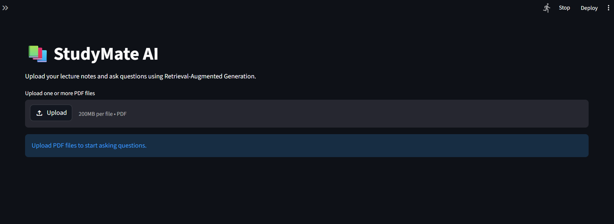
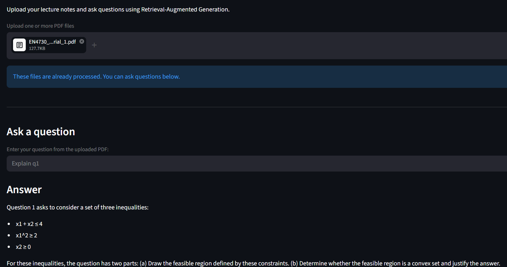

# StudyMate AI

StudyMate AI is a Retrieval-Augmented Generation based lecture notes assistant. It allows users to upload PDF lecture notes and ask questions from the uploaded documents.

The system retrieves relevant content from the PDFs using semantic search and generates grounded answers using Gemini.

## Project Motivation

Students often have many lecture notes, slides, and PDFs to revise before exams. Finding exact information from long documents can be time-consuming.

StudyMate AI helps students ask questions directly from their lecture notes and receive answers with source references.

## Features

- Upload one or more PDF files
- Extract text from lecture note PDFs
- Split documents into overlapping chunks
- Generate embeddings using Gemini embeddings
- Store document vectors using FAISS
- Ask natural language questions from uploaded documents
- Generate answers using Gemini
- Display source page references
- Maintain chat history during the session
- Configure model names through environment variables
- Validate missing API key before running the app

## Tech Stack

- Python
- Streamlit
- LangChain
- LangChain Classic
- LangChain Google GenAI
- Google Gemini API
- FAISS
- PyPDF
- python-dotenv

## System Architecture

```text
PDF Upload
    ↓
PDF Text Extraction
    ↓
Text Chunking
    ↓
Embedding Generation
    ↓
FAISS Vector Store
    ↓
User Question
    ↓
Similarity Search
    ↓
Relevant Context Retrieval
    ↓
Gemini Answer Generation
    ↓
Answer + Source References
```

More details are available in:

`docs/architecture.md`

## Folder Structure

```text
studymate-ai/
│
├── app.py
├── requirements.txt
├── README.md
├── .env.example
├── .gitignore
│
├── data/
│   └── uploaded_pdfs/
│
├── vectorstore/
│
├── screenshots/
│
└── docs/
    └── architecture.md
```

## Installation

1. Clone the repository

```bash
git clone https://github.com/YOUR_USERNAME/studymate-ai.git
cd studymate-ai
```

2. Create a conda environment

```bash
conda create -n studymate python=3.10 -y
conda activate studymate
```

3. Install dependencies

```bash
pip install -r requirements.txt
```

4. Create a .env file

Create a .env file in the project root:

```text
GOOGLE_API_KEY=your_google_api_key_here
GEMINI_MODEL=gemini-2.5-flash
GEMINI_EMBEDDING_MODEL=models/gemini-embedding-001
```

The .env file is ignored by Git and should not be uploaded to GitHub.

5. Run the app

```bash
streamlit run app.py
```

## How to Use

- Start the Streamlit app.
- Upload one or more PDF lecture notes.
- Wait until the vector store is created.
- Ask a question from the uploaded documents.
- Read the generated answer.
- Expand the source sections to verify where the answer came from.

## Example Questions

- Explain this lecture in simple words.
- Give me exam-ready points from this document.
- What is the difference between project scope and product scope?
- Where is project charter explained?
- Summarize the main points of this PDF.

## Screenshots

### Home Page



### Answer with Sources



## Environment Variables

| Variable | Description |
| --- | --- |
| GOOGLE_API_KEY | Google Gemini API key |
| GEMINI_MODEL | Gemini chat model used for answer generation |
| GEMINI_EMBEDDING_MODEL | Gemini embedding model used for document embeddings |

## Current Limitations

- Scanned PDFs are not supported unless OCR is added.
- Very large PDFs may take longer to process.
- The app currently stores chat history only during the active session.
- Answer quality depends on the retrieved chunks.
- Requires internet access and a valid Gemini API key.

## Future Improvements

- Add OCR support for scanned PDFs
- Add persistent document library
- Add user authentication
- Add PDF export for answers
- Add retrieval quality evaluation
- Add local LLM support
- Add adjustable chunk size and retrieval settings in the UI

## What I Learned

Through this project, I learned how to:

- Build a RAG pipeline
- Process PDF documents
- Split text into chunks
- Generate embeddings
- Store vectors using FAISS
- Retrieve semantically relevant text
- Use Gemini for grounded answer generation
- Display source references
- Manage API keys safely using environment variables
- Structure and document an AI project for GitHub

## Author

Pasindu Nimsara